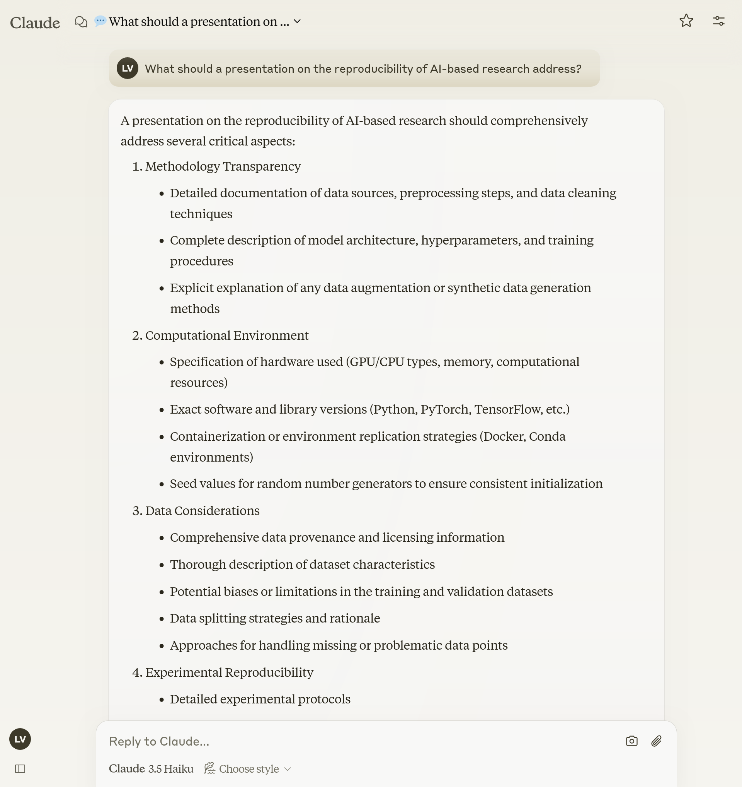

# What does Claude say (edited)? 

```{r}
# Read and display the content of the prompts
mylines("korinek-2023/lars-prompt1.txt",charlimit="99",prefix="> ")
```

## Response

[^claude1]

See [full response](index.html#/what-did-claude-say) as well as [OpenAI's response](index.html#/what-did-openai-say)
[^claude1]: claude.ai, Haiku, Normal, 2024-12-14 20:47

## Response (edited) {.smaller}

```
A presentation on the reproducibility of AI-based research should comprehensively address several critical aspects:

1. Methodology Transparency
2. Computational Environment
3. Data Considerations
4. Experimental Reproducibility
5. Code and Implementation
6. Ethical and Contextual Considerations
7. Validation Strategies
8. Reporting Challenges

By comprehensively addressing these areas, the presentation can provide a robust framework for understanding and potentially replicating AI-based research, ultimately contributing to the scientific integrity and advancement of the field.
```

## Comparison {.smaller}

:::: {.columns}

::: {.column width=50%}

Claude:

1. Methodology Transparency
2. Computational Environment
3. Data Considerations
4. Experimental Reproducibility
5. Code and Implementation
6. Ethical and Contextual Considerations
7. Validation Strategies
8. Reporting Challenges

:::

::: {.column width=50%}

OpenAI:

1. Introduction to Reproducibility
2. Challenges in Reproducibility
3. Data Accessibility
4. Algorithm and Model Transparency
5. Documentation and Reporting Standards
6. Tools and Platforms for Reproducibility
7. Case Studies and Examples
8. Community and Collaboration
9. Ethical and Legal Considerations
10. Future Directions and Recommendations

:::

::::
