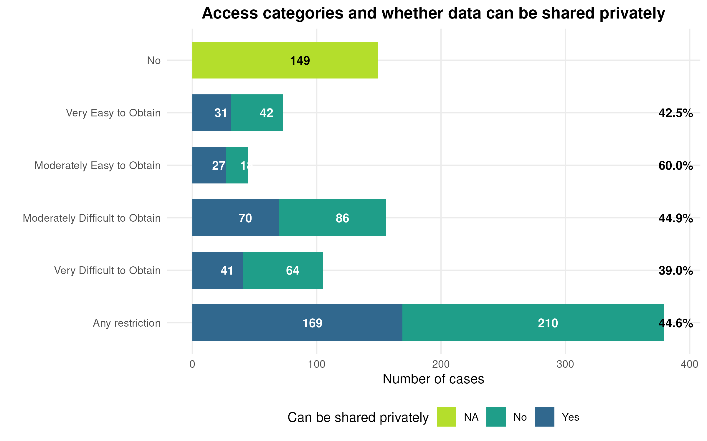

# The Problem

## Computational Reproducibility in the Social Sciences

- Research communities increasingly require sharing of **data, code, and methods**
- Trend is clear: *any data* that can reasonably be shared, and all code, *should be made available*
- Consumers combine data and code, **re-run it**, and validate the analysis

## Computational Reproducibility in the Social Sciences {.smaller}

**But what makes this hard in practice?**

:::: {.columns}
::: {.column width="70%}

- Data withheld for *ethical*, legal, or contractual reasons

:::
::: {.column width="30%}

:::
::::

## Computational Reproducibility in the Social Sciences {.smaller}

**But what makes this hard in practice?**

:::: {.columns}
::: {.column width="70%}

- Data withheld for ethical, legal, or contractual reasons
- Processing is time-consuming or requires *rare computing* resources

:::
::: {.column width="30%}

:::
::::

## Computational Reproducibility in the Social Sciences {.smaller}

**But what makes this hard in practice?**

:::: {.columns}
::: {.column width="70%}

- Data withheld for ethical, legal, or contractual reasons
- Processing is time-consuming or requires rare computing resources
- Raw data may be transient, ephemeral, or *deleted*

:::
::: {.column width="30%}

:::
::::

## Inaccessibility is normal

::: {.columns}
::: {.column width="55%"}

From the AEA Data Editor's experience (2025, 384 papers assessed):

- **38%** used data with no access restrictions — *in scope for replication studies*
- **62%** used data subject to access restrictions

:::
::: {.column width="45%"}

:::
:::

## ... but solvable

::: {.columns}
::: {.column width="55%"}

Of those restricted papers:

- The AEA team obtained private access to **45%** of the 62%
- Conducted reproducibility checks despite data not being in public packages

:::
::: {.column width="45%"}

:::
:::

