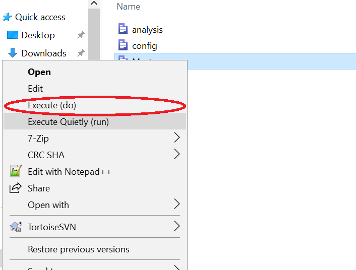

# Hands-off running: Creating a controller script

Did it take you a long time to run everything again?


## Let's ramp it up a bit. 

- Your code must run, **beginning to end**, top to bottom, without error, and **without any user intervention**. 

- This should in principle (re)create all **figures**, **tables**, and **in-text numbers** you include in your paper. 


::: {.notes}
We have seen users who appear to highlight code and to run it interactively, in pieces, using the program file as a kind of notepad. This is not reproducible, and should be avoided. It is fine for debugging.
:::

## Seem trivial?

> Out of **8280** replication packages in ~20 top econ journals, only  **2594** (**31.33%**) had a main/controller script.[^resultsmain]

[^resultsmain]: Results computed on Nov 26, 2023 based on a scan of replication packages conducted by Sebastian Kranz. 2023. "Economic Articles with Data". https://ejd.econ.mathematik.uni-ulm.de/, searching for the words `main`, `master`, `makefile`, `dockerfile`, `apptainer`, `singularity` in any of the program files in those replication packages. Code not yet integrated into this presentation.

## TL;DR

- Create a "main" file that runs all the other files in the correct order.
- Run this file, without user intervention.
- It should run without error.

## Creating a main or master script

In order to be able to enable "hands-off running", the **main (controller) script is key**. I will show here a few simple examples for single-software replication packages. We will discuss more complex examples in one of the next chapters.

## Examples


## Stata {auto-animate=true}

::::{.columns}

:::{.column width=40%}

Set the root directory (dynamically)

:::

:::{.column width=60%}

```{.stata code-line-numbers="1-2"}
* main.do
global rootdir : pwd
* Run the data preparation file
do $rootdir/01_data_prep.do
* Run the analysis file
do $rootdir/02_analysis.do
* Run the table file
do $rootdir/03_tables.do
* Run the figure file
do $rootdir/04_figures.do
* Run the appendix file
do $rootdir/05_appendix.do
```

:::
::::

## Stata {auto-animate=true}

::::{.columns}

:::{.column width=40%}

Call the various files that consitute your complete analysis.

:::

:::{.column width=60%}

```{.stata code-line-numbers="4,6,8,10,12"}
* main.do
global rootdir : pwd
* Run the data preparation file
do $rootdir/01_data_prep.do
* Run the analysis file
do $rootdir/02_analysis.do
* Run the table file
do $rootdir/03_tables.do
* Run the figure file
do $rootdir/04_figures.do
* Run the appendix file
do $rootdir/05_appendix.do
```

:::
::::


## Notes

- The use of `do` (instead of `run` or even `capture run`) is best, as it will show the code that is being run, and is thus more transparent to you and the future replicator.

## Notes

- Run this using the [right-click method](https://labordynamicsinstitute.github.io/ldilab-manual/96-02-running-stata-code.html#step-6-run-the-code) (Windows) or from the terminal (macOS, Linux): 

:::: {.columns}

::: {.column width=60%}



:::

::: {.column width=40%}

```bash
cd /where/my/code/is
stata-mp -b do main.do
```
where `stata-mp` should be replaced with `stata` or `stata-se` depending on your licensed version.

:::
::::


## R {auto-animate=true}


:::: {.columns}

::: {.column width=40%}

Set the root directory (using `here()` or `rprojroot()`).

:::

::: {.column width=60%}

```{.r code-line-numbers="3-4"}
# main.R
## Set the root directory
# If you are using Rproj files or git
rootdir <- here::here()
# or if not
# rootdir <- getwd()
## Run the data preparation file
source(file.path(rootdir, "01_data_prep.R"), 
       echo = TRUE)
## Run the analysis file
source(file.path(rootdir, "02_analysis.R"), 
       echo = TRUE)
## Run the table file
source(file.path(rootdir, "03_tables.R"), echo = TRUE)
## Run the figure file
source(file.path(rootdir, "04_figures.R"), echo = TRUE)
## Run the appendix file
source(file.path(rootdir, "05_appendix.R"), echo = TRUE)
```

:::
::::


## R {auto-animate=true}


:::: {.columns}

::: {.column width=40%}

Call each of the component programs, using `source()`.

:::

::: {.column width=60%}


```{.r code-line-numbers="8-9|11-12|14|16|18"}
# main.R
## Set the root directory
# If you are using Rproj files or git
rootdir <- here::here()
# or if not
# rootdir <- getwd()
## Run the data preparation file
source(file.path(rootdir, "01_data_prep.R"), 
       echo = TRUE)
## Run the analysis file
source(file.path(rootdir, "02_analysis.R"), 
       echo = TRUE)
## Run the table file
source(file.path(rootdir, "03_tables.R"), echo = TRUE)
## Run the figure file
source(file.path(rootdir, "04_figures.R"), echo = TRUE)
## Run the appendix file
source(file.path(rootdir, "05_appendix.R"), echo = TRUE)
```

:::
::::

## Notes for R {auto-animate=true}

The use of `echo=TRUE` is best, as it will show the code that is being run, and is thus more transparent to you and the future replicator.

## Notes for R {auto-animate=true}

Even if you are using Rstudio, run this using the [terminal method](https://labordynamicsinstitute.github.io/ldilab-manual/96-12-running-r-code.html) in Rstudio for any platform, or from the terminal (macOS, Linux): 

```bash
cd /where/my/code/is
R CMD BATCH main.R
```

Do not use `Rscript`, as it will not generate enough output! 

## Other examples

For examples for **Julia, Python, MATLAB,** and **multi-software scripts**, see the [full text](https://larsvilhuber.github.io/self-checking-reproducibility/02-hands_off_running.html).

## Takeaways {.smaller}


- [x]  your code runs without problem, after all the debugging.
- [x] your code runs without manual intervention, and with low effort
- [ ] it actually produces all the outputs
- [ ] your code generates a log file that you can inspect, and that you could share with others.
- [ ] it will run on somebody else's computer


