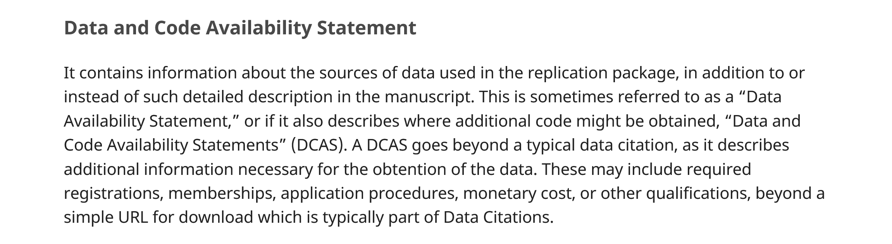
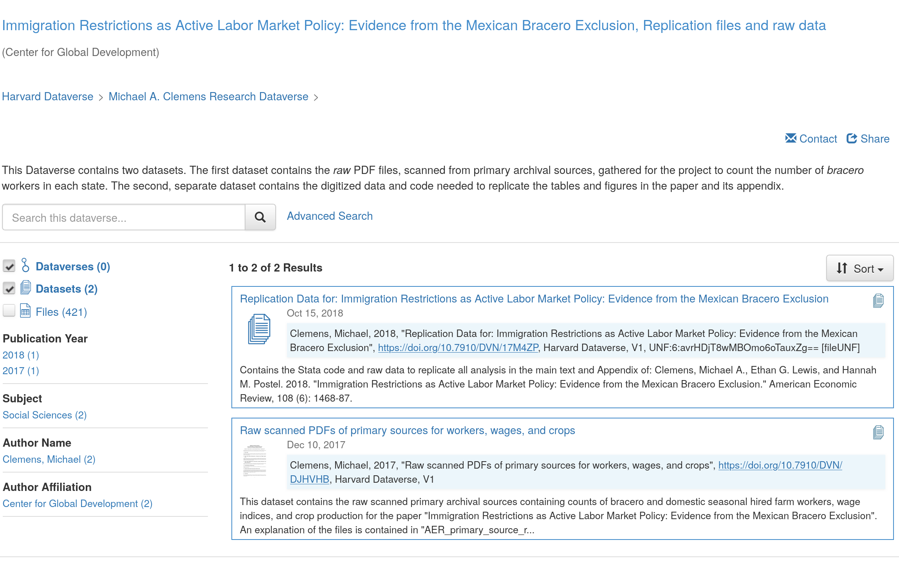
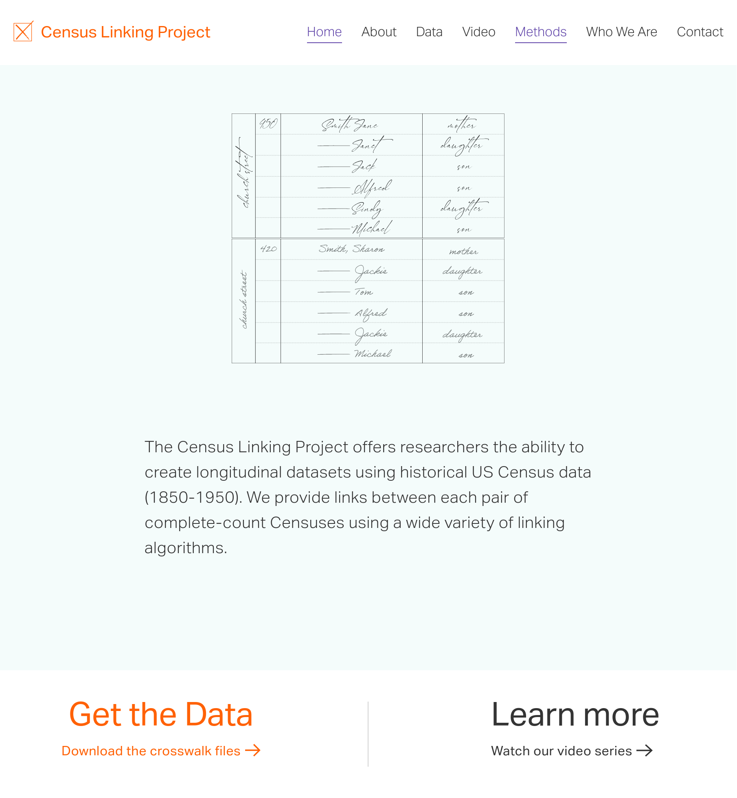

# Let's talk about data

## Types of Data

- Data used for training
- Data used for analysis
- Data output by the algorithm

## Questions for Data  {auto-animate=true transition=fade .smaller}

::: incremental

- Where did the (training/analysis) data come from? 
  - Can you share it? 
  - Can others obtain access? 
  - Is it still there? 
- Where did you put the analysis data?
  - Can you share it?
  - If not, why not? 
  - Can you preserve it?

:::

## Guidance in README

## Data Provenance

> Are **models** data or software?
>  - will treat as **software** here.

## Data Provenance

- Are the source data **preserved**?
  - Often large **text** archives
  - Format relevant: physical or electronic copy?

## Good example  {auto-animate=true .smaller}

:::: {.columns}
::: {.column width="50%"}
> "Immigration Restrictions as Active Labor Market Policy: Evidence from the Mexican Bracero Exclusion, Replication files and raw data" (Michael Clemens)

- Hosted on **Harvard Dataverse** at <https://dataverse.harvard.edu/dataverse/bracero>

:::
::: {.column width="50%"}

:::
::::

## Raw data  {auto-animate=true .smaller}

:::: {.columns}
::: {.column width="50%"}

> Clemens, Michael, 2017, “**Raw scanned PDFs of primary sources for workers, wages, and crops**”, <https://doi.org/10.7910/DVN/DJHVHB>, Harvard Dataverse, V1

:::
::: {.column width="50%"}

:::
::::

## Your analysis data

Probably requires

- substantial computing resources (time, cost, space)
- lesser storage resources 

## Good example  {auto-animate=true .smaller}

:::: {.columns}
::: {.column width="50%"}
> Clemens, Michael, 2018, “**Replication Data for:** Immigration Restrictions as Active Labor Market Policy: Evidence from the Mexican Bracero Exclusion”, <https://doi.org/10.7910/DVN/17M4ZP>, Harvard Dataverse, V1
:::
::: {.column width="50%"}

:::
::::

## LLM-specific considerations

Generically,

`pre-trained LLM` ▶️ `tuned LLM` ▶️ `analysis data`

## LLM-specific considerations

- `tuned LLM` = f(`training data` $D^t$,`pre-trained LLM`)
- `analysis data` $\widetilde{D}$= f(`tuned LLM`,`raw data` $D^*$)

**Both should be preserved**

## LLM-specific considerations

- size?
- where?

## LLM-specific considerations

`tuned LLM`:

- can you release it? (privacy)
- does **Hugging Face** have a preservation policy? (*no*)
- license to apply to it?

## LLM-specific considerations

:::: {.columns}
::: {.column width="50%"}

`analysis data` $\widetilde{D}$:

- can be preserved as part of the replication package 
  - Clemens example

:::
::: {.column width="50%"}

:::
::::

## LLM-specific considerations

:::: {.columns}
::: {.column width="50%"}

`analysis data` $\widetilde{D}$:

- could be preserved separately, if multi-purpose 
  - example: [`Census Linking Project`](https://censuslinkingproject.org/)

:::
::: {.column width="50%"}

 
:::
::::

## LLM-specific considerations

:::: {.columns}
::: {.column width="50%"}

`analysis data` $\widetilde{D}$:

- could be preserved separately, if multi-purpose 
  - example: Dell's "[**American Stories**](https://doi.org/10.57967/hf/0757)" LLM [@dell_research_harvard_2023]

:::
::: {.column width="50%"}

 
:::
::::
