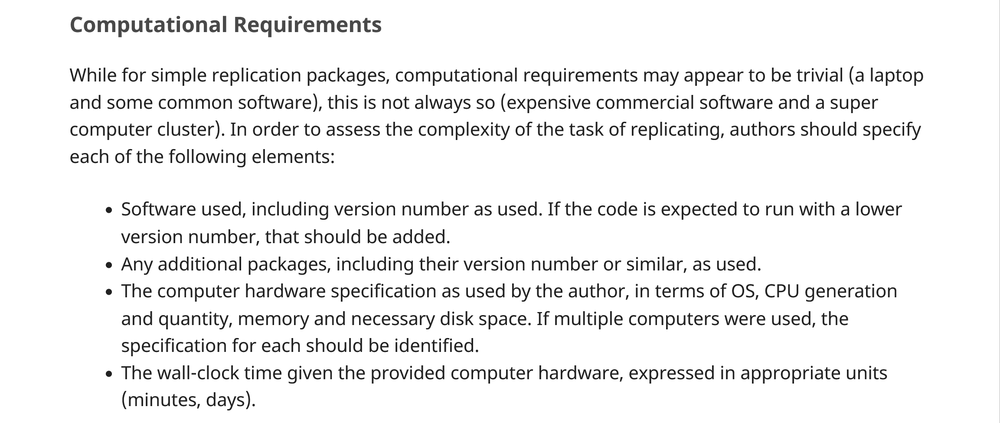
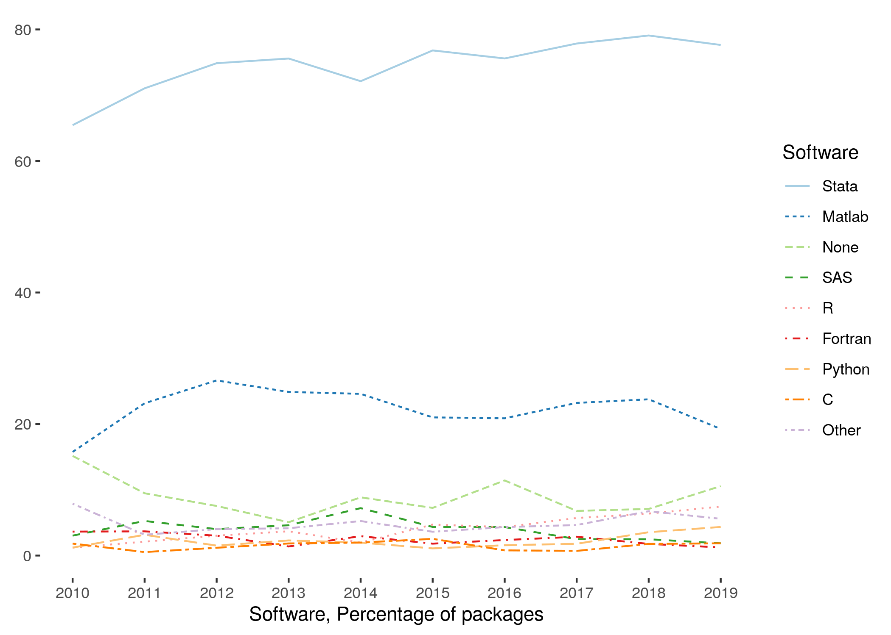
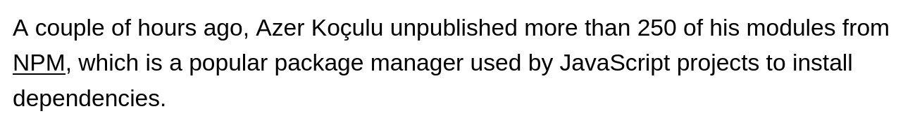

# Computing Requirements

## Guidance in README

## Computational Environment

Describe what **YOU** used

- relevant hardware, own and rented (CPU/GPU, memory, storage)
- necessary software, including library versions (Python, R, whatever)

## Computational Environment

BUT:

- do not list what your computer has installed - list what you **used for this project**
- (`pip freeze` without an environment will be too much!)

## Computational Environment

Describe what **the REPLICATOR** needs to have or install

- may require that some library is left "loose"
- should be as **abstract as necessary** (is Linux necessary, convenient, or irrelevant?)

## None of this is AI specific!

## LLM-specific considerations

- But LLMs may have some stricter-than-usual operating conditions
- Most economists don't need **dual Nvidia RTX 3090** for their computing...

> Be as specific as necessary, but no more!

## Commercial Software

## Software with access limitations

- Most economists use **commercial** software
- Most use the **same** software, so access is not as constraining as it might seem at first blush
- Commercial software **can go away** (or licenses expire) ([but...](https://hub.docker.com/u/dataeditors))

## Software without access limitations

- In principle, much **open-source** software is more robustly archived 
  - all older R versions and packages on CRAN!
- But points of failure for others (PyPi, NPM, etc.)

## LLM-specific considerations

Reminder

`pre-trained LLM` ▶️ `tuned LLM` ▶️ `analysis data`

## Where do the `pre-trained LLMs` roost?

## "Community"?

> In August 2023, the company announced that it raised $235 million in a Series D funding, at a **$4.5 billion valuation**. The funding was led by **Salesforce**, and notable participation came from Google, Amazon, Nvidia, AMD, Intel, IBM, and Qualcomm.[^hf]

[^hf]: [Wikipedia](https://en.wikipedia.org/w/index.php?title=Hugging_Face&oldid=1262960684) on 2024-12-15.

## But...

- **Hugging Face** does assign **DOIs** to **some** models
- Presumption of some preservation (no guarantees)

## AI-specific considerations

- OpenAI released **GPT-2** in 2019 as a **non-profit**. See [@OpenaicommunityGpt2Hugging].
- But: **GPT-3** was **not** released after OpenAI transitioned to become **commercial**. 
- Specific **versions** of models may not be available after some time, at the discretion of the provider.

## This is less of an issue for OS LLMs (maybe)

- Example: [`Llama-3`](https://huggingface.co/meta-llama/Llama-3.2-1B)
- But: no DOI. Could be withdrawn?

