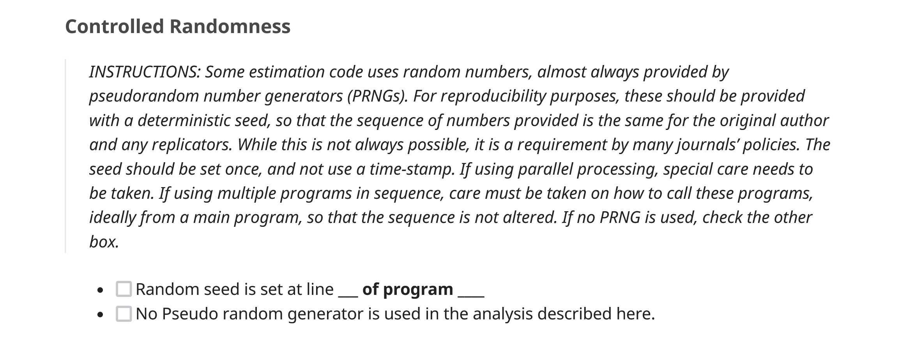

# Metadata 

## Metadata {auto-animate=true .smaller}

Beyond cost, what else?

- Information on tuning, hyperparameters, etc. - any manual steps!
- Seeds for pRNG and information if they work!

## Metadata {auto-animate=true .smaller}

Beyond cost, what else?

- Information on tuning, hyperparameters, etc. - any manual steps!
- Seeds for pRNG and information if they work!
- Variability and what replicators should expect
