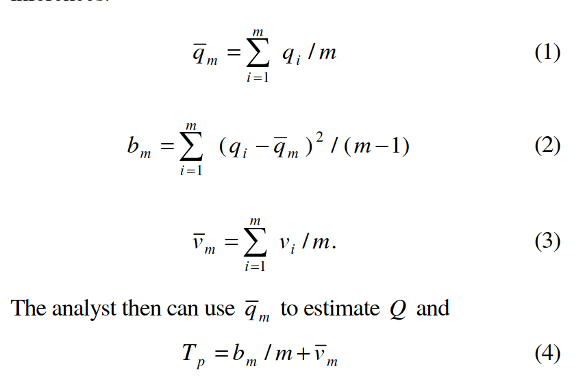

# Run it all again

The very first test is that your code must run, **beginning to end,** top to bottom, without error, and ideally without any user intervention. This should in principle (re)create all figures, tables, and numbers you include in your paper. 

## TL;DR

This is pretty much the most basic test of reproducibility. 

> This has nothing to do with LLM/AI!

If you cannot run your code, you cannot reproduce your results, nor can anybody else. So just re-run the code.

## Exceptions

## Code runs for a very long time

What happens when some of these re-runs are very long? See later in this chapter for how to handle this.

## Making the code run takes YOU a very long time

While the code, once set to run, can do so on its own, *you* might need to spend a lot of time getting all the various pieces to run. 

---

{.center width="350" height="300"}

*This should be a warning sign:* 

If it takes you a long time to get it to run, or to manually reproduce the results, it **might take others even longer**.[^warning-sign] 

[^warning-sign]: Source: [Red Warning PNG Clipart](https://www.pngall.com/warning-sign-png/download/69408), CC-BY.

---

Furthermore, it may suggest that you **haven't been able to re-run** your own code very often, which can be indicate  **fragility** or even **lack of reproducibility**. 

## Takeaways {.smaller}

::: {.incremental}

- [x] your code runs without problem, after all the debugging.
- [ ] your code runs without manual intervention, and with low effort
- [ ] it actually produces all the outputs
- [ ] your code generates a log file that you can inspect, and that you could share with others.
- [ ] it will run on somebody else's computer

:::

# LLM specificity of runtime variability

## Inherent variability

- LLMs are **probabilistic** by design, so some variability is expected
- "Temperature"  is meant to control this, but imperfect

> Is your result robust?

## LLM output as a Multiple Imputation problem 

:::: {.columns}

::: {.column width="50%"}
- [@rubin1993] is credited with one of the first formalizations of multiple imputation
- Often used for privacy protection, but also missing data
- See [@reiter2004,@ReiterJ.Stat.Plan.Inference2005] for inference rules
:::
::: {.column width="50%"}

:::
::::

## LLM output as a Multiple Imputation problem {auto-animate=true transition=fade .smaller}

**Recommendation**

:::: {.columns}
::: {.column width="50%"}
- Run the LLM (query) multiple times (e.g., 10 times) -> $D^*_m, m=1,...,10$
:::
::: {.column width="50%"}

:::
::::

## LLM output as a Multiple Imputation problem {auto-animate=true transition=fade .smaller}

**Recommendation**

:::: {.columns}
::: {.column width="50%"}
- Run the downstream analysis for each $D^*_m$ -> ${q}_m, v_m, m=1,...,10$
:::
::: {.column width="50%"}

:::
::::

## LLM output as a Multiple Imputation problem {auto-animate=true transition=fade .smaller}

**Recommendation**

:::: {.columns}
::: {.column width="50%"}
- Use multiple imputation rules (Rubin, Reiter, etc.) to report
  - sampling variability inherent in the underlying data $D^*$: $\bar{v}$
  - variability due to the variability in the LLM output $b$
:::
::: {.column width="50%"}

:::
::::

## LLM-specific considerations

- Be precise about all the parameters
- Also store outputs from API (but: privacy concerns are real!)
- Document the variability in the output (e.g., by running multiple times)